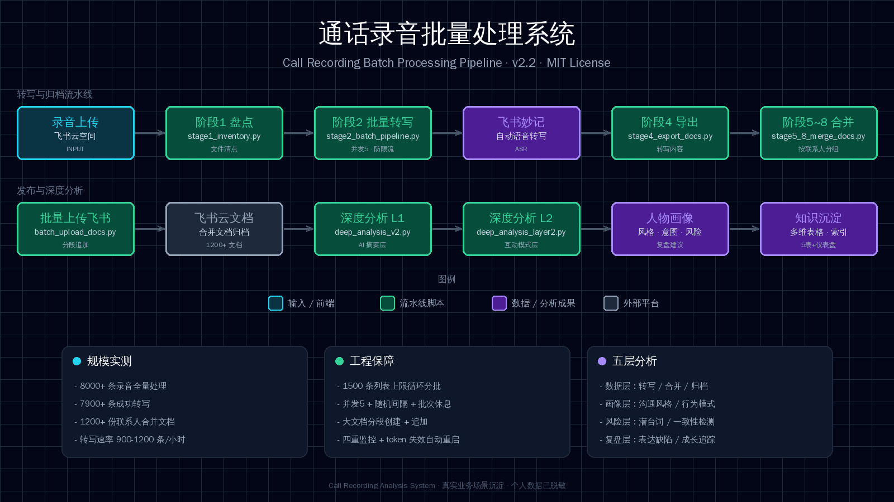

<div align="center">



# 📞 通话录音批量处理系统

**8000+ 条通话录音批量转写、按联系人合并归档、人物画像 / 意图风险 / 自我复盘五层深度分析、飞书知识库沉淀**

[SkillHub 在线安装](https://skillhub.cn/skills/call-recording-analysis-system) · [快速使用](#快速使用) · [核心能力](#核心能力) · [使用边界](#使用边界)

</div>

---

这是作者在真实业务场景中沉淀的可复用 AI Agent 技能（Skill）：从「海量通话录音」到「结构化知识库」的完整自动化流水线，含全量处理实测的流程、参数与避坑清单。

## 快速使用

将本仓库放入 Agent 技能目录后，用对应触发词调用，Agent 会自动加载并执行完整流程。

```text
帮我批量处理通话录音：转写、按联系人合并、深度分析
```

核心流水线：

```bash
# 0. 环境：Python 3.8+ + lark-cli + 飞书企业账号（妙记额度）
# 1. 阶段1盘点
python3 stage1_inventory.py
# 2. 阶段2批量创建妙记（转写）
python3 stage2_batch_pipeline.py
# 3. 阶段4导出
python3 stage4_export_docs.py
# 4. 阶段5~8按联系人合并
python3 stage5_8_merge_docs.py
# 5. 批量上传飞书
python3 batch_upload_docs.py
# 6. 深度分析（第一层 / 第二层）
python3 deep_analysis_v2.py && python3 deep_analysis_layer2.py
```

> 脚本包含个人环境适配逻辑，随私有环境保留；核心流程、参数与避坑规则已在本仓库完整描述，可据此自行实现。

## 核心能力

| 能力 | 说明 |
|------|------|
| 批量转写 | 飞书妙记自动转写，并发 5 + 随机间隔防限流，实测约 900-1200 条/小时 |
| 按联系人合并 | 自动按联系人/号码分组，生成统一格式的合并文档（深度分析+目录+关键词+完整对话） |
| 五层深度分析 | 数据 → 人物画像 → 意图与风险 → 自我复盘 → 知识沉淀 |
| 飞书知识库 | 合并文档永久保存飞书云文档 + 多维表格索引（说明书/数据统计/文档目录/目标/导航） |
| 断点续跑 | 进度文件 + 失败退避 + 定时监控自动重启，长时间任务可无人值守 |
| 防坑内置 | 1500 条列表上限、大文档分段追加、token 失效重启等实测避坑规则固化 |

## 触发场景

- 批量处理通话录音（几百到几千条）
- 通话记录按联系人整理归档
- 沟通复盘与自我提升分析
- 联系人画像与意图风险识别

## 使用方式（安装）

- **Hermes**: 放入 `skills/` 目录
- **Claude Code**: 放入 `~/.claude/skills/`
- **Cursor**: 放入 `.cursor/skills/`
- **SkillHub**: 一键安装（见上方徽章链接）

## 目录结构

<details>
<summary><strong>查看完整目录</strong></summary>

```text
SKILL.md                    # 主技能文件：流程、参数、避坑规则
README.md                   # 项目说明
docs/完整说明文档.md         # 详细版说明（脱敏）
assets/pipeline-architecture.html  # 流水线架构图（HTML/SVG）
requirements.txt            # 依赖说明
LICENSE                     # MIT
```

</details>

## 使用边界

- 本技能来自个人实践沉淀（8000+ 条通话录音全量处理实测），参数为实测值，不同账号额度/网络环境需微调
- 不包含任何个人数据：真实联系人、号码、通话内容均不在此仓库
- 依赖飞书企业账号 + 妙记会员额度
- 涉及大量 API 调用，务必遵守限流参数（并发 5、间隔 1.5-4s、批次休息 30s）

## License

MIT
